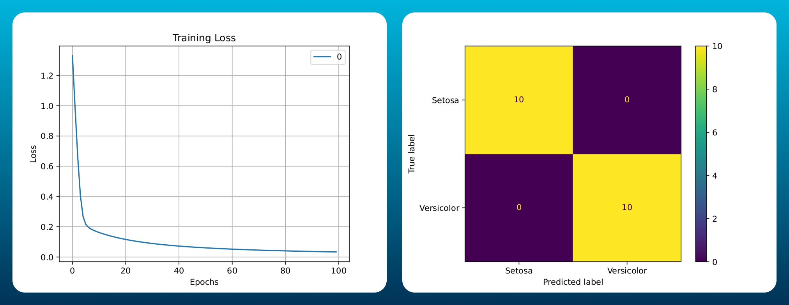

# Perceptron

> Basic building block to advanced neural networks in Deep Learning

## About
This repository contains an implementation of a basic perceptron, a type of artificial neural network and supervised learning algorithm. The perceptron is primarily used for binary classification tasks, where it learns to classify data points into one of two categories.

## Features
- Simple implementation of the Perceptron learning algorithm.
- Includes data input, training, and output generation.
- Demonstrates basic principles of machine learning and neural networks.
- **Activation Function:** Sigmoid function
- **Loss Function:** Binary Cross Entropy (Log Loss)
- **Dataset**: Iris dataset, limited to Setosa and Versicolor iris classes.

## Files

- **main.py**: The main script to run the perceptron algorithm.
- **src/**: Source code for the perceptron model.
- **data/**: Directory for input data files.
- **output/**: Directory to graph outputs (Training Loss and Confusion Matrix)

## Output



## Installation
1. Clone this repository:
    ```bash
    git clone https://github.com/ARey-H39/perceptron.git
    ```
2. Open the repository directory:
    ```bash
    cd perceptron
    ```
3. Install dependencies (if any):
    ```bash
    pip install -r requirements.txt
    ```

## Usage
To run the perceptron, simply execute the `main.py` script:
```bash
python main.py
```
